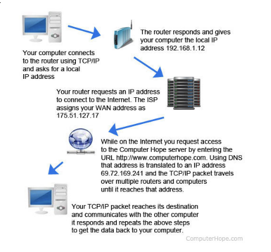

--> Qu’est-ce qu’une adresse IP ?

Une adresse IP est ce qui permet d’identifier chaque machine connecté à un réseau utilisant le protocole IP.
L’adresse IP est composée de 4 octets allant de 0 à 255 séparés par des points.
Adresses Ipv4 (4 octets) :
4 octets * 8 bits = 32 bits
Adresses Ipv6 (16 octets) :
16 octets * 8 bits = 128 bits


--> Qu’est-ce qu’un masque de sous-réseau

Les adresses IPv4 sont composées de deux parties : le sous-réseau et l'hôte.
Un sous-réseau est une subdivision logique d'un réseau de taille plus importante. Le masque de sous-réseau permet de distinguer la partie de l'adresse commune à tous les appareils du sous-réseau et celle qui varie d'un appareil à l'autre.


--> Qu’est-ce que le sous-réseau d’une IP avec un masque de sous-réseau


--> Quelle est la différence entre une IP privée et une IP publique ?

Une adresse IP publique permet de communiquer avec les autres reseaux, elle est unique au monde.
Une adresse IP privée permet de communiquer au sein d'un même reseau local.
–	Les adresses privées de la classe A : 10.0.0.0 à 10.255.255.255 (comprend 16 millions d’adresses)
-	Les adresses privées de la classe B : 172.16.0.0 à 172.31.255.255 (comprend 65535 adresses)
–	Les adresses privées de la classe C : 192.168.1.0 à 192.168.255.255 (comprend 256 adresses)
-	Les adresses publiques sont toutes les autres.


--> Quelles sont les différentes classes d’IP ?

–	La classe A de l’adresse IP 0.0.0.0 à 126.255.255.255
–	La classe B de l’adresse IP 128.0.0.0 à 191.255.255.255
–	La classe C de l’adresse IP 192.0.0.0 à 223.255.255.255
–	La classe D de l’adresse IP 224.0.0.0 à 239.255.255.255
–	La classe E de l’adresse IP 240.0.0.0 à 255.255.255.255


### 1. What is an IP address?
It is a network address for our computers and the internet knows where to send informations and data.
Every website (42, Microsoft, Apple, etc.) has a unique IP address, but it goes by its name instead (42, Microsoft, Apple, etc.) But without IP addresses you couldn't connect with them and they couldn't share information with you.
IP Addres is composed of:  **[ network  ]  [ host  ]**
**IP Addres Example:**
```bash
	66.171.248.170
```

### 2. What is a Netmask?
A Netmask is a 32-bit **"mask"** used to divide an IP address into subnets and specify the network's available hosts.

### 3. What is the subnet of an IP with Netmask
It is called a subnet mask because it is used to identify network address of an IP address by perfoming a bitwise AND operation on the netmask.
```bash
	<network> <subnet> <host>
```

### 4. What is the broadcast address of a subnet?
Highest IP address in a subnet or network, used as the destination IP address for broadcast messages.

### 5. What are the different ways to represent an ip address with the Netmask?

Netmask is a 32-bit "mask" used to divide an IP address into subnets and specify the network's available hosts.

```bash
255.255.255.0 is applied to the 129.144.41.101 , the result is the IPv4 address of 129.144.41.0
```
129.144.41.101 **AND** 255.255.255.0 = **129.144.41.0**

In binary form, the operation is:

```bash
10000001.10010000.00101001.01100101		<== (IPv4 address)
AND
11111111.11111111.11111111.00000000		<==(netmask)
```

### 6. What are the differences between public and private IPs?

Public Ip  can to be static or dynamic.
 - A static address is unchanged and is often for hosting websites, server.
 - A dynamic address are chasen from a "pool" of available addresses and will be changed each time user connects.

### 7. What is a class of IP addresses?

IP address in class A, class B and class C.

| Class	|  Starting IP address	| Ending Ip Address|  # of hots | 
--------|-----------------------|------------------|------------| 
|  A 	| 10.0.0.0		| 10.255.255.255   | 16,777,216 |
|  B 	| 172.16.0.0		| 172.31.255.255   | 1,048,576  |
|  C 	| 192.168.0.0		| 192.168.255.255  | 65,536     |

### 8. What is TCP?

TCP (Transmision Control Protocol)
Main protocols of the internet protol suite.

- Keeps track of lost packages, makes sure that lost packages are re-sent
- Addes sequesce numbers to packets and reorders any packets that arrive in thenworng order.
- Slower, because of all added additional functionality.
- Requieres more computer resources, because the OS needs to keep track of ongoing communication sessions and manage them on a much deeper level.

### 9. What is UDP?

- Doesn't keep track of lost packages
- Doesn't care about package arrival order.
- Faster, bacause it lacks any extra features.
- Requieres less computer resources.
- Examples of programs and services that use UPD:
	- DNS
	- IP telephony
	- DHCP
	- Many computer games

**Why we use UDP?**

Many applications that requiere real-time communication prefer to use UDP, applications that requiere speed and that torerat partial data loss.

### 10. What are the network layers?

In the seven-layer OSI model of computer network, the network layer is layer 3. The network layer is responsible for packet forwarding including routing through intermediate routers.

### 11. What is the OSI model?

The Open System Interconnection (OSI). It has been developed by ISO - 'International Organization of Standardization'. It is a 7 layer architecture with each layer having specific functionality to perform. All tese 7 layers work collaboratively to transmit the data fr4om one person to another across the globe.

 | Layer		| Kind	         |
 |----------------------|----------------|
 | Application Layer	| software layer |
 | Presentatation layer	| software layer |
 | Session Layer	| software layer |
 | Transport Layer	| Heart of OSI   |
 | Network Layer	| hardware Layer |
 | Data Link Layer	| hardware Layer |
 | Physical layer	| hardware Layer |


### 12. What is a DHCP server and the DHCP protocol
 
 DHCP server: DHCP (Dynamic Host Confivguration Protocol), is a protocol that provides quick, automatic, and central management for the distribution of IP addresses within a network. DHCP is also used to configure  the subnet mask, default gateway and DNS server information on the device.

### 13. What is a DNS server and the DNS protocol?

Domain Name System (DNS) is the phonebook of internet. Web browsers interact through Internet Protocol (IP) addresses. DNS translates domain names to IP addresses so browsers can load internet resources.

The **Domain Network System (DNS) protocol** helps internet users and network devises discover websites using human-readable hostnames, instead of  numeric IP addresses.

### 14. What are the rules to make 2 devices communicate using IP addresses?



### 15. How does routing work with IP?

- Routing is the process by which data packets move from one node (machine or device) to another on a computer network until the packets reach the final destination.

The header information includes:
- The IP addresses of the source and destination nodes.
- Packet numbers that help reassemble the packets in the correct order whe  the packets reach the destination. 
- Other useful technical information.

### 16. What is a default gateway for routing?

 It allows devices within one network to send information to devises within another network. If you are requestiong a certain web page, the trafic is first sent to your default gateay before leaving the local network to reach its indended destination.

### 17. What is a port from an IP point of view and what is it used for when connecting?

In computer networking, a port is a communication endpoint. At the software level, within an operating system, a port is a logical construct that identifies a specific process or a type of network service. 
 Ports are identified for each protocol and address combination by 16-bit unsigned numbers, commonly known as the port number. The most common protocols that use port numbers are the Transmission Control Protocol (TCP) and the User Datagram Protocol (UDP).
